# Essential Linux Commands
# 1. Basic Commands
## 1.1  Navigation and File Operations
## i. 'pwd' Command - Print Working Directory
pwd, an acronym for "present working directory," displays the current directory's full path.
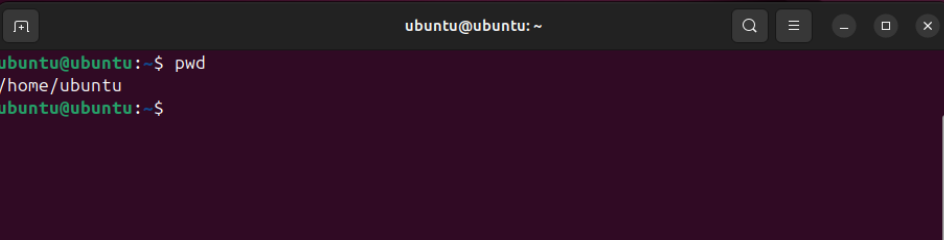
## ii. 'ls' Command - List directory contents
The ls command lists files and directories in the current directory. 
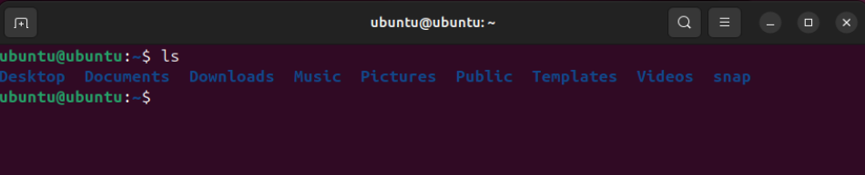
For example, ls -a displays all files, including hidden ones.
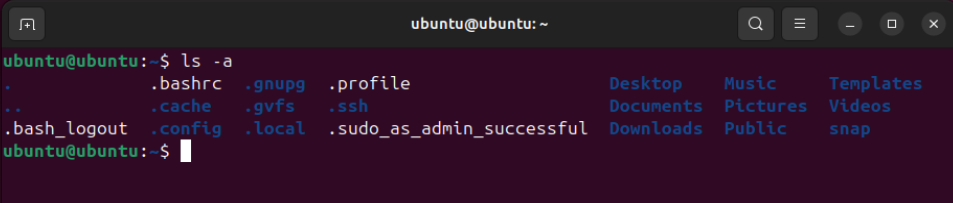
## iii. 'cd' Command - Change directory
The cd command, short for "change directory," allows users to switch directories. If no directory is specified, it defaults to the user's home directory.
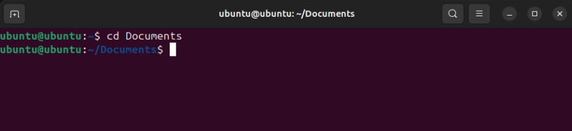
## iv. 'cp' Command - Copy files or directories
The cp command copies files or directories to a specified location, useful for creating backups or duplicating data.
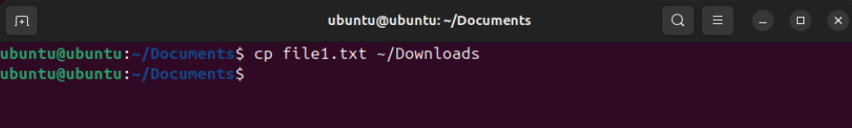
To confirm the file was copied to the Downloads directory, use the cd command to navigate to the destination (Downloads) directory and list the contents with the ls command.
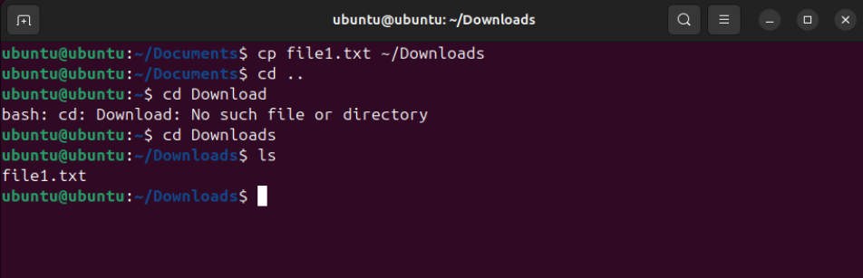
## v. 'mv' Command - Move/rename files or directories
The mv command moves or renames files and directories. If the destination exists, it will be overwritten.
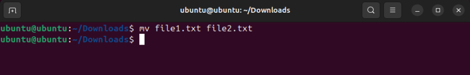
Use the ls command to verify the mv command operation. 
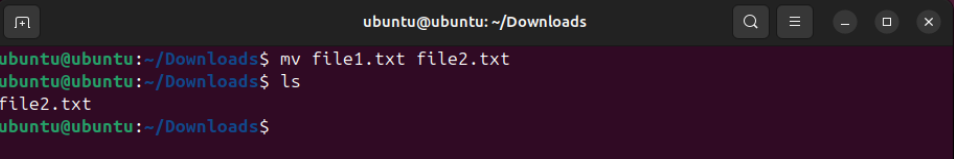
## vi. 'rm' Command - Remove files or directories
The rm command deletes files or directories. Multiple files can be removed simultaneously. ls command used to verify the rm command.
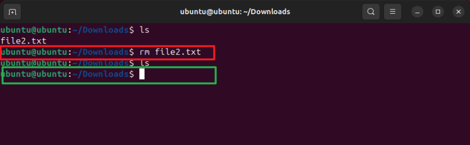
## vii. 'mkdir' Command - Create a new directory
The mkdir command creates new directories. Multiple directories an be created simultaneously.

Use the ls command to verify the mkdir command operation.
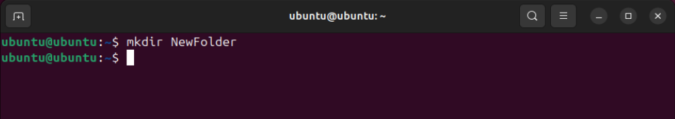
## viii. 'rmdir' Command - Remove an empty directory
The rmdir command removes empty directories.
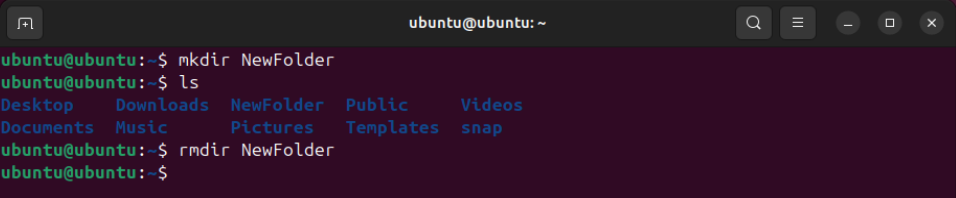
Use the ls command to verify the rmdir command operation.
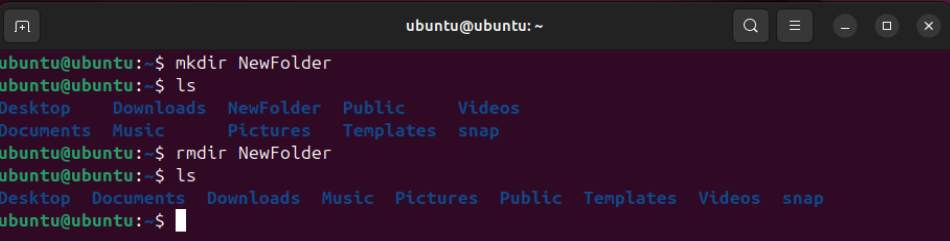
## ix. 'touch' Command - Create an empty file or update the timestamp
The touch command creates an empty file or updates the timestamp of an existing file.
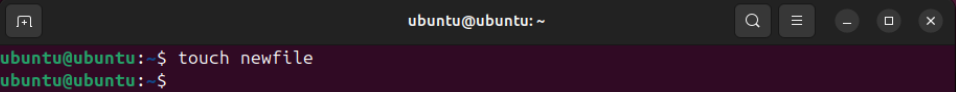
Use the ls command to verify the touch command operation.

