# Essential Linux Commands
# 1. Basic Commands
## 1.1  Navigation and File Operations
Navigation and file operations in Linux involve a set of essential commands that allow users to interact with the filesystem
## i. 'pwd' Command - Print Working Directory
pwd, an acronym for "present working directory," displays the current directory's full path.

pwd command syntax:`pwd`

## ii. 'ls' Command - List directory contents
The ls command lists files and directories in the current directory. 

ls command syntax:`ls`

For example, ls -a displays all files, including hidden ones.

command syntax:`ls -a`
 
## iii. 'cd' Command - Change directory
The cd command, short for "change directory," allows users to switch directories. If no directory is specified, it defaults to the user's home directory.

cd command syntax:`cd [directory]`

## iv. 'cp' Command - Copy files or directories
The cp command copies files or directories to a specified location, useful for creating backups or duplicating data.

cp command syntax:`cp [option] source destination`

`cp filename.txt /path/to/destination/`

 

To confirm the file was copied to the Downloads directory, use the cd command to navigate to the destination (Downloads) directory and list the contents with the ls command.

## v. 'mv' Command - Move/rename files or directories
The mv command moves or renames files and directories. If the destination exists, it will be overwritten.

mv command syntax: `mv [options] source destination`
 

Use the ls command to verify the mv command operation. 

## vi. 'rm' Command - Remove files or directories
The rm command deletes files or directories. Multiple files can be removed simultaneously. ls command used to verify the rm command.

rm command syntax: `rm [options] file(s)`

to remove a single file syntax: `rm filename.txt`
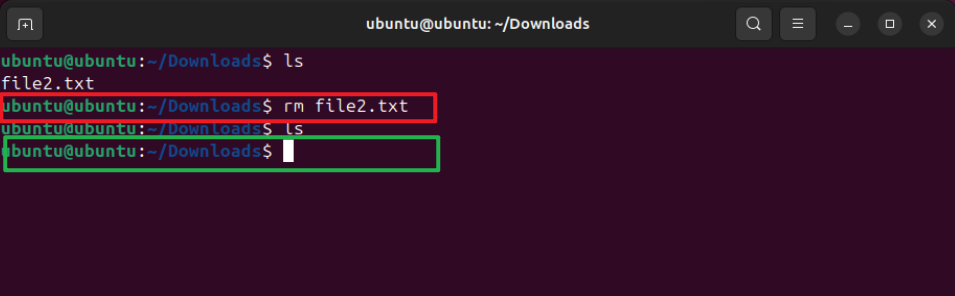

to remove multiple file syntax: `rm file1.txt file2.txt file3.txt`
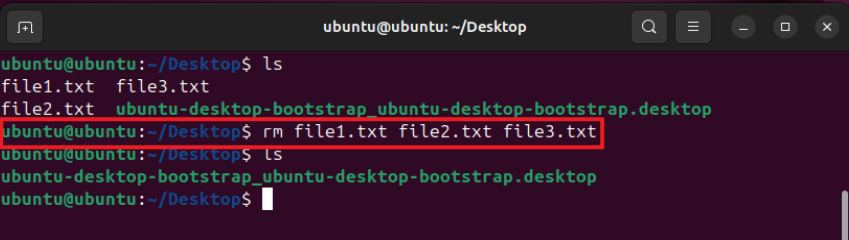

to remove directory syntax: `rm -r directoryname`
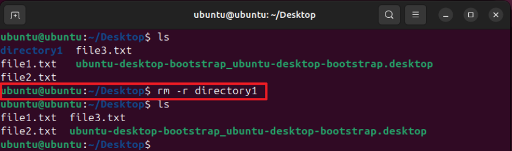

to force remove a file or directory without prompting for confirmation: `rm -f filename.txt`
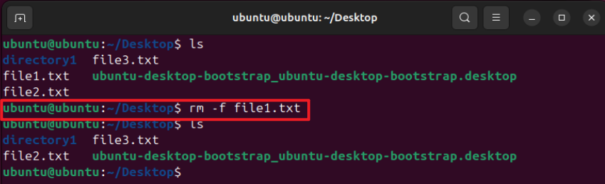

to force remove a directory and its contents without prompting for confirmation: `rm -rf directoryname`
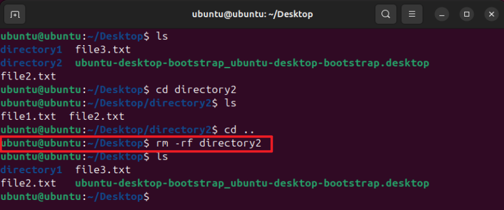

## vii. 'mkdir' Command - Create a new directory
The mkdir command creates new directories. Multiple directories an be created simultaneously.

mkdir command syntax: `mkdir directory.name`
 
Use the ls command to verify the mkdir command operation.

## viii. 'touch' Command - Create an empty file or update the timestamp
The touch command creates an empty file or updates the timestamp of an existing file.

touch command syntax: `touch file.name`

Use the ls command to verify the touch command operation.

## 1.2 Viewing and Editing Files
There are bunch of Linux commands and text editors that come in handy when you need to check out or make changes, to files. Tools like cat, more, less, head and tail help you peek into file contents in ways. When it comes to editing nano is an user friendly text editor option while vi caters to those looking for advanced functionalities. These tools are crucial for navigating through files, in a Linux setup.
## i. 'cat' command - Concatenate and display file content
cat, short for "concatenate," reads, combines, and displays file contents. Use cat followed by the file name to execute.

cat command syntax:`cat filename.txt`

## ii. 'more' command - View file content interactively
more command displays the contents of a file, one screen at a time in the terminal. It’s useful if you have a large file. For instance, cat displays the entire contents of a file all at once. Using more, you navigate through the file, page by page. It’s quite handy for large files.

more command syntax:`more filename.txt`
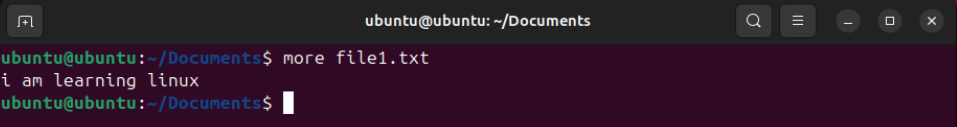

Excuting more command with large file
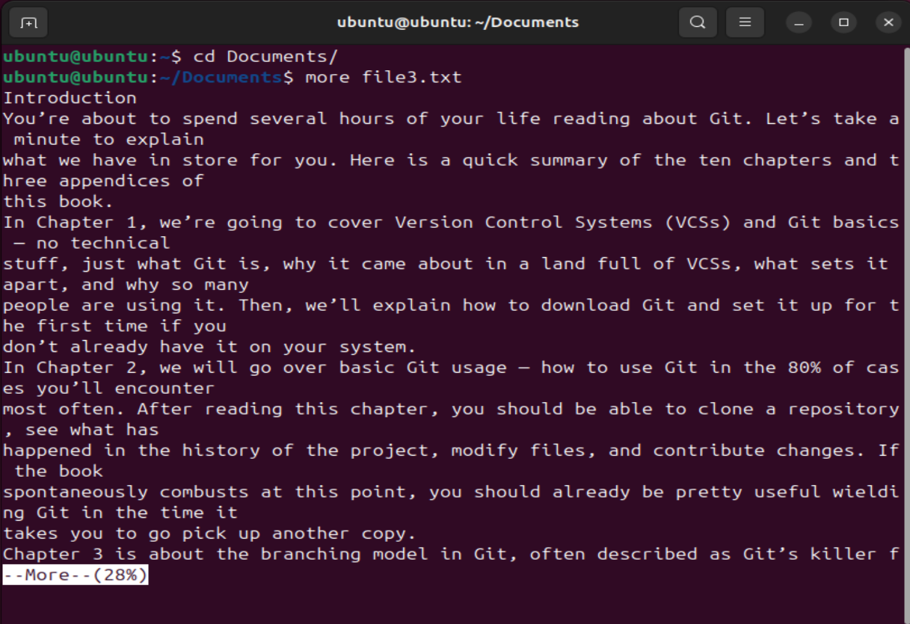
### Key Navigation for more command
    - Press 'Space' to move to the next page.
    - Press 'Enter' to move to the next line.
    - Press 'b' to move back one page.
    - Press 'q' to quit the more viewer.
## iii. 'less' command - View file content interactively with more options
The less command works similar to the more command in the terminal, but with more advanced features. It allows not just forward but backward navigation through the file as well.

less command syntax:`less filename.txt`
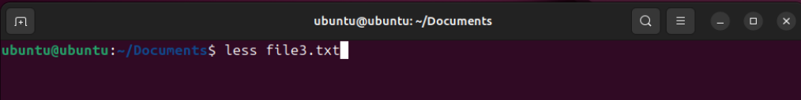
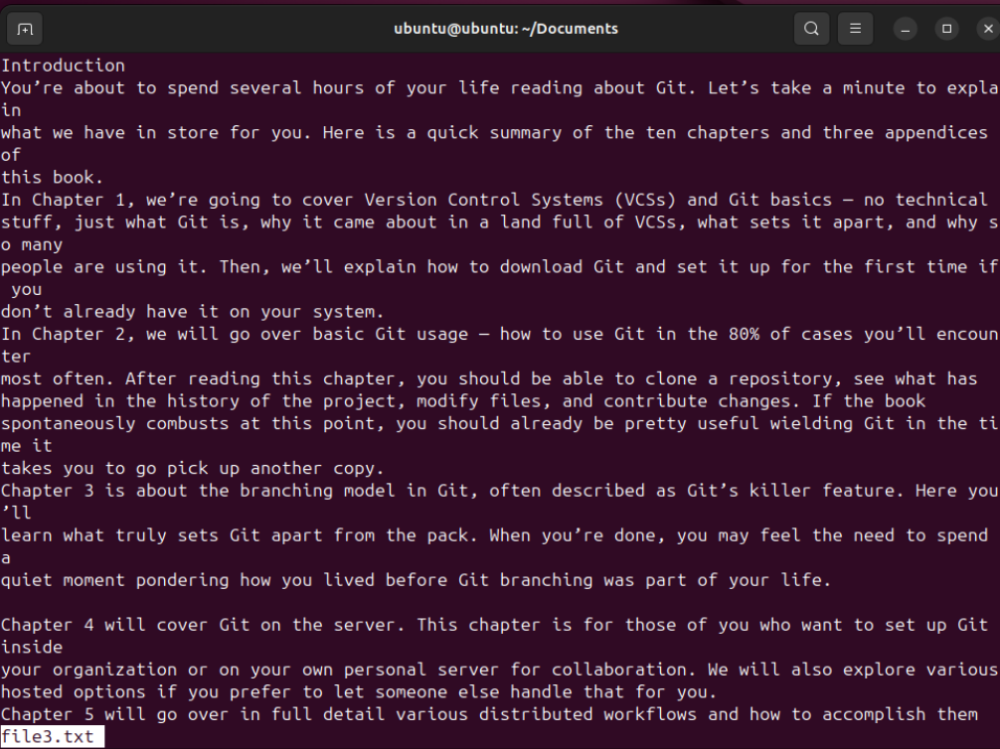
### Key Navigation for less command
    - 'Space' or 'f' to move forward one page.
    - 'b' to move backward one page.
    - 'Enter' to move forward one line.
    - 'y' to move backward one line.
    - 'n' to repeat the last search forward.
    - 'N' to repeat the last search backward.
    - 'q' to quit the viewer.
## iv. 'head' commad - View the first few lines of a file
The head command shows the first few lines of a file. You can specify the number of lines from the command line with an option.

head command syntax: `head [Option] filename.txt`
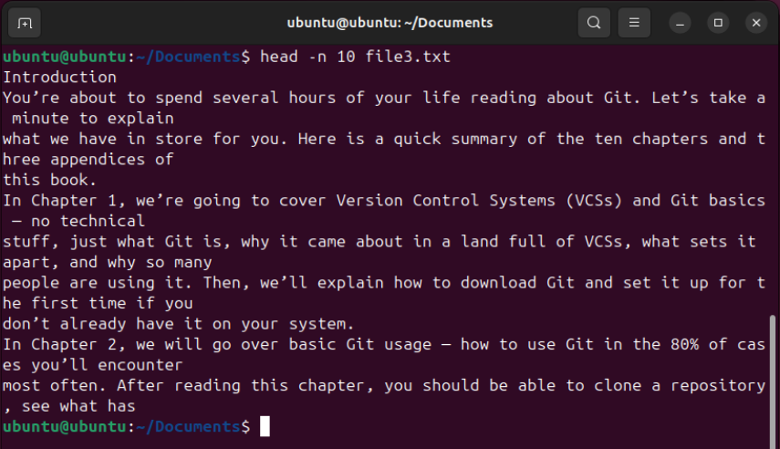

## v. 'tail' command - View the last few lines of a file
The tail command prints the last 10 lines of a file, useful for reviewing newly-written data or to check error messages.

tail command syntax: `tail [Option] filename.txt`
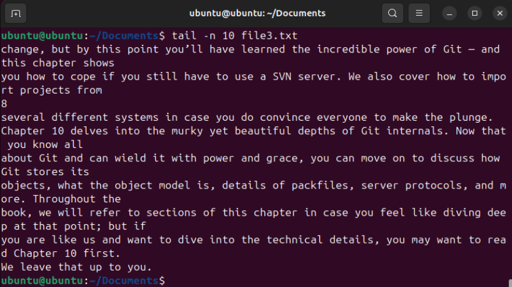

## vi. Nano & vi- Simple text editor
Two of the most widely used Linux text editors are Nano and vi, each with advantages and disadvantages of their own. Nano is incredibly user-friendly and basic. Nano is great for binners who just wants to open a text file, make a few quick changes, and close it, this is ideal. With its very clear screen and commands that can be executed on it for simple editing and navigation, Nano doesn't require any prior knowledge to begin using. On the other hand, vi is incredibly configurable and powerful. Power users discover that it becomes incredibly simple to use because it has so many power features and shortcuts. Thus, vi can be used to make intricate changes to a file.
#### To execute nano command
nano command syntax: `filename.txt`
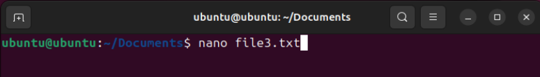
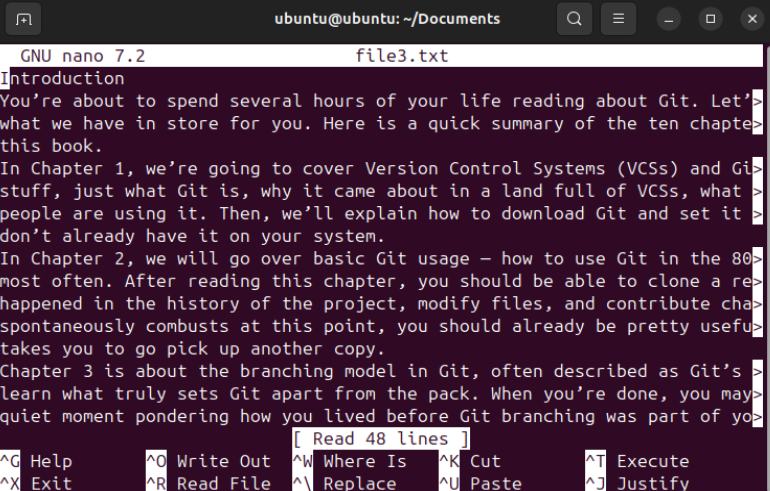
#### Key Commands
    - ^G (Ctrl + G): Display help
    - ^O (Ctrl + O): Write out (save) the file
    - ^X (Ctrl + X): Exit Nano
    - ^W (Ctrl + W): Search within the file
    - ^K (Ctrl + K): Cut text
    - ^U (Ctrl + U): Paste text
    - ^C (Ctrl + C): Show the current cursor position
    - ^\ (Ctrl + ): Replace text
 To save the changes, press Ctrl + O, then press enter to exit. To close Nano, press Ctrl + X. If you have unsaved changes, you’ll be prompted to save them before Nano exits.
#### To execute vi command
Basic Vim Modes:
Normal Mode: For navigation and text manipulation (default mode when Vim starts).
Insert Mode: For text entry (press i to enter this mode from Normal Mode).
Command-Line Mode: For executing commands (press : to enter this mode from Normal Mode).

vi command syntax: `vi filename.txt`
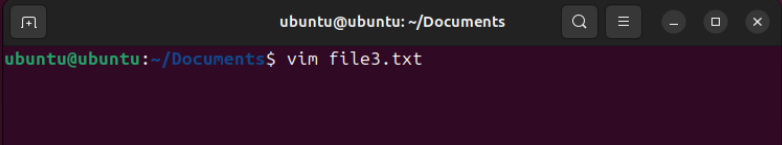

vi Key Commands:
#### In Normal Mode:
    - i: Switch to Insert Mode at cursor position.
    - Esc: Switch back to Normal Mode.
    - :w: Save the file.
    - :q: Quit Vim.
    - :wq: Save and quit Vim.
    - :q!: Quit without saving changes.
#### In Insert Mode:
    - Esc: Switch back to Normal Mode.
#### Command-Line Mode:
    - :w: Save the file.
    - :q: Quit Vim.
    - :wq: Save and quit Vim.
    - :q!: Quit without saving changes.

